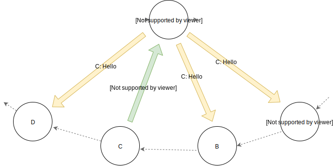

.. _ref-impl:

How the Program Works
=====================

This section describes, how is the distributed chat implemented and what technology is used.

Technology
----------
The program is implemented in AsyncIO. It uses a few new techniques, so you need **Python 3.7 or newer** to run it.

All the network connections are resolved via Asyncio ``Streams``. Every connection is TCP realized through the ``asyncio.StreamReader`` and ``asyncio.StreamWriter`` classes.

The whole program is asynchronous. Every node keeps 3 connections open at once.

Implementation
--------------

This section describes the inner mechanisms of the program.

The Leader Node
^^^^^^^^^^^^^^^
In order to avoid confusion, in this documentation the term *leader* will be used for the coordinating node of the chatroom and the term *server* will be used for the networking part of the node that listens to network connections. It means that every node has a *server*, however only one node in the chatroom is the *leader*.

The leader is the coordinator of the chat room -- it receives the user messages from other nodes and broadcasts them to all other nodes in the chatroom.

The leader is the only node in the chatroom that actually knows and is connected to all the other nodes.

When the leader disconnects or dies, a new one must be elected. How it's done it described in the next sections.

   Node ``C`` sends message to the leader. The leader broadcasts it to the other nodes.

The Network Topology
^^^^^^^^^^^^^^^^^^^^
The chatroom is defined as one network ring. This means that any node only knows its two neighbors, in the program called *next* and *previous*. Plus, every node knows the leader in order to sent it a message.

When a node disconnects or dies, the ring must be renewed. Let's say, that node ``B`` has two neighbors -- ``A`` and ``C``. ``A`` is its previous node and ``C`` is its next node. It means that any communication in the ring goes from node ``A`` to ``B`` and then from ``B`` to ``C``.

When node ``B`` logs out, the following happens:
  * Both ``A`` and ``C`` detect, that their neighbor died and that the ring must be repaired.
     .. figure:: _static/node_left_detection.svg
  * Node ``C`` knows that when its previous node (``B``) dies, it needs to send a message to node ``B``'s previous node, so that ``B``'s previous node knows who its new next node will be.
  * A message is sent by ``C`` to the ring. Every node in the way reads it and if its next node id dead, it connects to the initial sender of this message.
     .. figure:: _static/node_left_new_conn.svg

This is how the ring repairs itself. However, only one node can leave it at once.

Leader Election
^^^^^^^^^^^^^^^
This program uses the `Chang-Roberts leader election algorithm <https://en.wikipedia.org/wiki/Chang_and_Roberts_algorithm>`_ to elect the leader node when it disconnects.

When the leader disconnects, first of all, the ring is renewed (the same way as described above).

Node ``A`` from the previous example is then the initiator of the election, because it knows the best when the ring is renewed and ready to operate again.

The node with the largest ID wins. The ID is basically just a string concatenation of its IP address and port.

The election message containing the leader candidate (the initial sender) is sent from ``A`` to the ring.

When a node ``X`` receives the election message with candidate ``Y`` inside, there are 3 possible scenarios:
  * The ID of the node ``Y`` is larger than the ID of the node ``X``
     It means that ``Y`` remains the leader candidate. ``X`` just passes the election message on to the ring.
  * The ID of the node ``X`` is larger than the ID of the node ``Y``
     This means that the node ``X`` is the new leader candidate. It writes its ID to the election message and passes it on to the ring.
  * The ID of ``Y`` is the same as ID of ``X``
     This means that the node ``X`` just received the election message it sent when the message was passing with a lower candidate ID. Node ``X`` just won the election

When a node wins the election, it sends the elected message to the ring. The elected message tells the other nodes who the winner is. All the other nodes immediately open a new connection to the newly elected leader.

Logical Time
^^^^^^^^^^^^
Any message sent in the program and any log message has a time stamp. This time stamp contains the logical time.

The logical time is calculated using `Lamport's algorithm <https://en.wikipedia.org/wiki/Lamport_timestamps>`_.

Basically, what happens, is:
   * Any node starts with logical time 0
   * When a process (a node) makes a *significant* action, its logical time is incremented by 1
   * When a node ``X`` receives a message from another node (``Y``), it synchronizes its logical time and increments it
       - ``time(X) = max( time(X), time(Y) ) + 1``

Logging in
^^^^^^^^^^
When a node wants to log in, it needs to be given an IP address and a port of any node that is already participating in the ring.

The node ``X`` wants to log in and contacts the node ``Y``:
 * ``X`` opens the connection and sends a login message to the node ``Y``
    .. figure:: _static/login_init.svg
 * ``Y`` receives the message and crafts and sends the answer. The answer contains: IP and port of the ``Y``'s next node and IP and port of the leader.
    .. figure:: _static/login_info.svg
 * ``X`` receives the answer. It connects to the ``Y``'s next node, which becomes ``X``'s next node. It also connects to the leader.
    .. figure:: _static/login_X_conn.svg
 * ``Y`` connects to ``X`` as ``X`` becomes the new next node of ``Y``
    .. figure:: _static/login_done.svg

Shortly said, the new node goes in front of the node it contacts during the login process.

Message Types
^^^^^^^^^^^^^
There are various message types in the program:
  * ``user_message``: chat message sent by another user (read from ``stdin``)
  * ``election_message``: message used during the elections, containing the candidate
  * ``login_message``: message sent by the node that wants to log in
  * ``prev_inform_message``: previous node is dead, inform its previous node about address and port to connect to
  * ``i_am_prev_message``: message sent by new prev node to its next node
  * ``hello_leader_message``: let the leader know about new node
  * ``elected_message``: leader is already elected